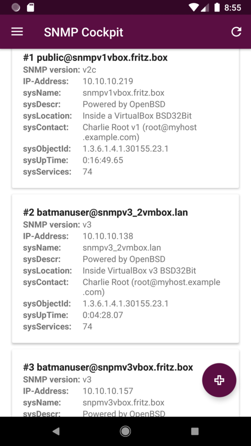
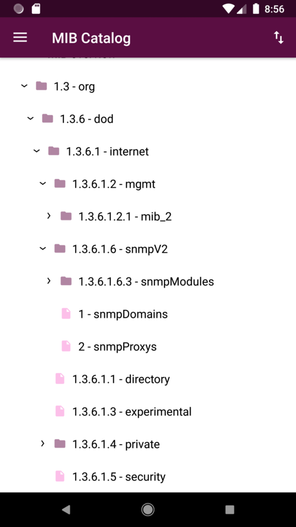
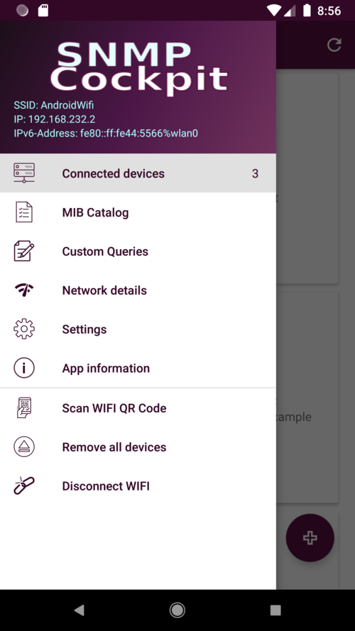
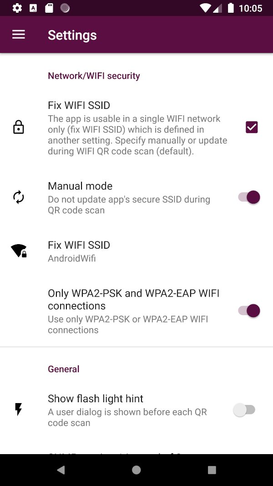
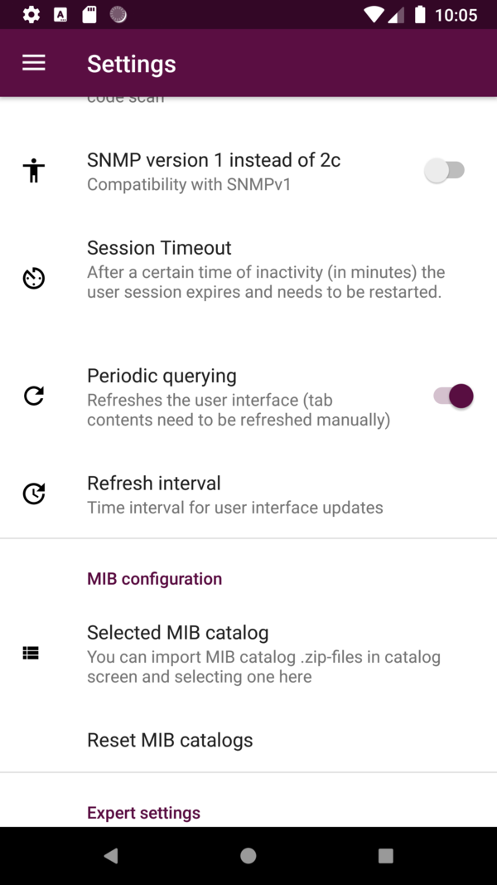
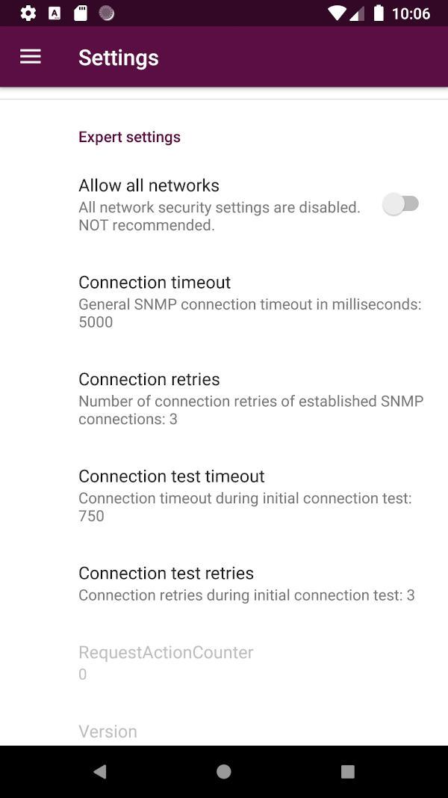

# SNMP Cockpit Android App 

<noscript></noscript>

A free software GPL v3 Android SNMP reader app. Its designed to be used in a single WIFI environment and includes several security mechanisms to ensure connectivity. This app supports QR code driven workflows for establishing WIFI network connections as well as initiating multiple SNMP connections with IPv4/v6 addresses and UDP protocol. To ease the work with MIBs there is a built-in, but replaceable, MIB catalog integrated.  
This project initially was started as a team project at university with a small other focus as it has today and not all stuff is well-tested. Please report feedback and bugs via [GitHub Issue Tracker](https://github.com/emschu/snmp-cockpit/issues) or via E-Mail. Thank you!

TODO add screenshots of device detail view

# General features
- establish SNMP v1/v2c/v3 connections between your smartphone and a SNMP demon in your WIFI IPv4/v6 network
- show basic system information and 20+ SNMP tables by default
- query results for single OIDs and SNMP tables
- use the built-in MIB catalog (RFC 1213 + common MIBs of *net-snmp*) or generate and import your own as described [here](./docs/MIB_catalog_guide.md)
- connect multiple SNMP endpoints/devices at once
- periodic user interface updates of displayed information
- QR code support for your SNMP endpoints for fast connection setup
- QR code support for your WIFI connection setup with "default" QR code format for WIFI networks
- this app does **not track you** and does not store sensitive information on your Smartphone (except RAM). Also, there is **no advertising**. Read the [Privacy Policy](./PRIVACY_POLICY.md) for more information about this.

## NOT included features
- SNMP write operations (atm not in the app's scope)
- SNMP traps

# Requirements
* `minSdk:` 23 (Android 6.0)
* `targetSdk:` 28 (Android 9.0)
* at least one SNMP capable device in your
* WIFI network

## Installation

### Features

- To establish a SNMP v1/v2c connection you need to provide the following information:
    - IP address
    - Community name
- for SNMP v3 connections:
    - IP
    - User
    - Auth-Password
    - Priv-Key
    - optional: Port
- A SNMP v3 connection coded into a QR code contains:
    - IP
    - User
    - SecurityLevel and dependent:
        - Password and/or
        - Priv-Key.
    - optional: AuthProtocol, PrivProtocol, Context
- Each device connection has a **device detail view** with several tabs. This app shows a lot (20+) of *default* tables there. Own queries can also be selected and shown here.
- The user interfaces of the main view as well as the detailed view of the devices are periodically updated *if activated in settings*.
- The app displays network information Android API provides.
- Any number of **own queries** can be managed with name, OID, query mode (single or walk) and hardware tags (also: "categories" or "hardware tags").
 *Note:* OIDs for queries within the app are handled without trailing zero (".0").
- Provide your own MIB catalog. Read [here](./docs/MIB_catalog_guide.md) how to do this.
- QR code format for WIFI connections and SNMP devices is described [here](./docs/QR_code_guide.md).
- **Hardware tags** (categories) can also be managed.
- The app is shipped with **3 possible network security levels**, each one *inherits* the properties of the one before:
    * **Level 1 - SNMP Cockpit App does not manage a network security state (**NOT recommended**)** 
    * **Level 2 - WPA2-PSK and WPA2-EAP only**
    * **Level 3a - Fixed WIFI name (SSID) (manual mode)**
        - Define a WIFI name in settings which is used for SNMP connections
    * **Level 3b - Fixed WIFI name (automatic mode)**:
        - The SSID scanned during the WIFI QR code scan must always apply to the connection. Each QR code wifi scan updates the fixed name string the app uses to define a "secure" network. 
        
**Supported auth protocols:** SHA-1, MD5, HMAC128SHA224, HMAC192SHA256, HMAC256SHA384, HMAC384SHA512

**Supported privacy protocols:** AES-128, DES, AES-192, AES-256, 3DES

*Note:* Most of the used (transport/auth) security mechanisms in SNMP protocol are weak and vulnerable in any way.

 More details about the SNMP connection is described [here](./docs/SNMP_connection_guide.md)
 
  If one of these **security states** above is violated during the app's runtime, e.g. when switching the network to another SSID, the app changes to the **Network Security Problem Mode** and a warning dialog **appears immediately** and the use of the app is blocked with the dialog until the problem is solved.

- If a SNMP connection does not respond for longer than a certain time (default: 5-10 seconds) during execution, the app switches to **connection timeout mode** with **warning dialog** and troubleshooting.

- For IP addresses its always possible to **specify a port manually** that differs from the assumed standard `161`.
- If SNMP connections are established by the app - without the help of a QR code - all authentication and transport protocols (A x T) are tried out until a **response to sysName** (1.3.6.1.2.1.1.5.0) is possible in a connection.
- Nevertheless - by certain specifications in the *enc* field of the QR code - each setting can also be determined manually, which is taken over during reading.
- It is possible to add your own tabs to **device detail view** through the area of your **own queries** or in the **MIB catalog** for the period of the session.
- It is possible to manage several (5-15 without problems, if your phone is capable of the CPU power and RAM) different connections at the same time.
- A tree view in the **MIB catalog** section basically represents RFC 1213 as well as further MIBS (for full list see below). When clicking on leaf nodes or long tap on folder nodes, this OID can be displayed in a new window or tab in the device detail view.
- The **configuration options** allow among other things:
    - The **duration of a user session** in minutes. After this period of inactivity, all connections will be removed.
    - On/Off switch and time setting for **periodic updates of the user interface** through firing basic SNMP queries, e.g. 5 seconds. Tables or Lists can be refreshed manually only.
    - On/Off switch for a **note for displaying a flashlight** during QR code scan.
    - **Timeout and retries for SNMP connections** of the app in general.
    - **Timeout and retries for connection test** (high values can slow you down during connection tests).
    - *RequestActionCounter* approximate number of executed tasks (~ snmp queries) the app has executed since last change of *versionCode*)

Another feature is the **Session Timeout mode**, which appears after some time of app inactivity, e.g. after a longer period of non-use of this app and then a sudden change back. Duration of the session in minutes is possible in the settings menu.

##### MIBs (built-in by default catalog) 

The following list is by default available:
- RFC1213-MIB 
- IP-MIB 
- IP-FORWARD-MIB
- SNMP-FRAMEWORK-MIB
- SNMP-MPD-MIB 
- TRANSPORT-ADDRESS-MIB 
- IF-MIB 
- IANA-RTPROTO-MIB 
- TCP-MIB 
- UDP-MIB 
- HOST-RESOURCES-MIB 
- HOST-RESOURCES-TYPES
- OPENBSD-BASE-MIB 
- OPENBSD-CARP-MIB 
- OPENBSD-MEM-MIB 
- OPENBSD-PF-MIB 
- OPENBSD-RELAYD-MIB 
- OPENBSD-SENSORS-MIB 
- UCD-SNMP-MIB 

This can be replaced with your own MIB collection. You need a python environment and a bash shell/unix environment. Use [this guide](./docs/MIB_catalog_guide.md).

##### Built-in SNMP tables

[docs/current_tab_contents.txt](./docs/current_tab_contents.txt)

## Configuration options

## Changelog

[CHANGELOG.md](CHANGELOG.md).

## Contribution

There are several ways possible contributing to this project:

- Please not hesitate to report and file issues in [GitHub Issue Tracker](https://github.com/emschu/snmp-cockpit/issues) or via E-Mail.
- Translate the app into other languages
- Create Pull Requests, Have a look at the small [Development guide](./docs/Development_guide.md)
- Extend and write documentation
- Provide useful SNMP catalog files as .zip (we will link them here)

## License

This project is licensed under [**GPL v3**](./LICENSE), except all third party components, MIBs and libraries and icons or unless stated otherwise.

### Libraries

* **Jackson Release 2.9.7**, Apache v2, *com.fasterxml.jackson.core:jackson-databind*
* **ZXing**, Apache v2, *com.journeyapps:zxing-android-embedded*
* **SNMP4J**, (modified), Apache v2, *org.snmp4j:snmp4j*
* **RecyclerTreeView** (modified), Apache v2
*[Repository](https://github.com/TellH/RecyclerTreeView)*
* **AboutLibraries**, Apache v2, [Repository](https://github.com/mikepenz/AboutLibraries)

### Static resources
- [Cube CSS Animation](
https://github.com/tobiasahlin/SpinKit/blob/master/css/spinners/11-folding-cube.css), MIT License

### Used icons:
* Eject Item (*ic_eject.xml*), Abfragen (*ic_list.xml*), Geräte (*ic_devices.xml*), Settings (*ic_settings.xml*):
Icon made by [Smashicons](https://www.flaticon.com/authors/smashicons) from [www.flaticon.com](www.flaticon.com), CC 3.0 BY

* QR-Code (*ic_qr_code.xml*):
Icon made by [becris](https://www.flaticon.com/authors/becris) from [www.flaticon.com](www.flaticon.com), CC 3.0 BY

* Disconnect (*ic_disconnect.xml*):
Icon made by [Freepik](https://www.freepik.com/) from [www.flaticon.com](www.flaticon.com), CC 3.0 BY

* Add-device (*ic_add_device.xml*):
Icon made by [xnimrodx](https://www.flaticon.com/authors/xnimrodx) from [www.flaticon.com](www.flaticon.com), CC 3.0 BY
