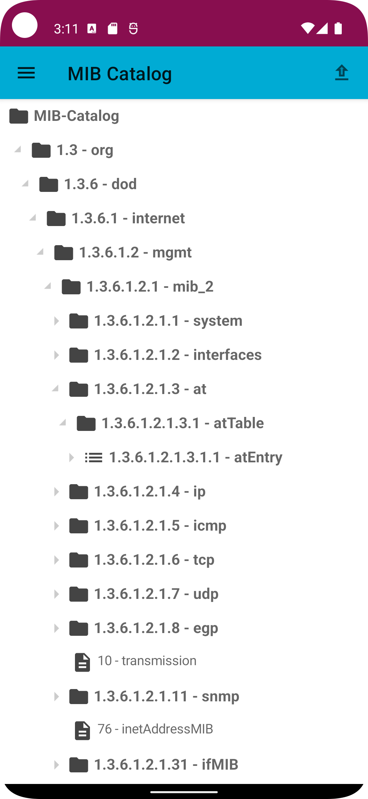

# SNMP Cockpit Android App

A free software GPL v3 Android SNMP reader app.

# Features

- Establish SNMP v1/v2c/v3 connections between your smartphone and a SNMP daemon service in your WIFI IPv4/v6 network
- Auto-detect SNMP v3 connection configuration
- Show basic system information and 20+ SNMP tables by default
- Query results for single OIDs and SNMP tables described [here](./docs/MIB_catalog_guide.md)
- Periodic user interface refresh
- QR code support for your SNMP endpoints for fast connection setup
- Show basic system information
- Custom queries with your OIDs, in single-query and recursive-query mode
- Integrated exchangeable MIB-Catalog (see documentation for more information)
  - Use the built-in MIB catalog (RFC 1213 + common MIBs of *net-snmp*) or generate and import your own as
- QR-code support for SNMP connections
- No tracking, no ads

Please report feedback and bugs via [GitHub Issue Tracker](https://github.com/emschu/snmp-cockpit/issues) or via E-Mail.
Thank you!

### NOT included features

- SNMP write operations (atm not in the app's scope)
- SNMP traps

## Requirements

* `minSdk:` 24 (Android 6.0)
* `targetSdk:` 34
* at least one SNMP capable device in your WIFI network

## SNMP information

**SNMP4J**, Apache v2, *org.snmp4j:snmp4j*

**Supported auth protocols:** SHA-1, MD5, HMAC128SHA224, HMAC192SHA256, HMAC256SHA384, HMAC384SHA512

**Supported privacy protocols:** AES-128, DES, AES-192, AES-256, 3DES

*Note:* Most of the used (transport/auth) security mechanisms in SNMP protocol are weak and vulnerable in any way.

More details about the SNMP connection is described [here](./docs/SNMP_connection_guide.md)

#### MIBs (built-in by default catalog)

The following list is by default available:

- RFC1213-MIB
- IP-MIB
- IP-FORWARD-MIB
- SNMP-FRAMEWORK-MIB
- SNMP-MPD-MIB
- TRANSPORT-ADDRESS-MIB
- IF-MIB
- IANA-RTPROTO-MIB
- TCP-MIB
- UDP-MIB
- HOST-RESOURCES-MIB
- HOST-RESOURCES-TYPES
- OPENBSD-BASE-MIB
- OPENBSD-CARP-MIB
- OPENBSD-MEM-MIB
- OPENBSD-PF-MIB
- OPENBSD-RELAYD-MIB
- OPENBSD-SENSORS-MIB
- UCD-SNMP-MIB

This can be replaced with your own MIB collection. You need a python environment and a bash shell/unix environment.
Use [this guide](./docs/MIB_catalog_guide.md).

##### Built-in SNMP tables

[docs/current_tab_contents.txt](./docs/current_tab_contents.txt)

## Configuration options

## Changelog

[CHANGELOG.md](CHANGELOG.md).

## Contribution

There are several ways possible contributing to this project:

- Please do not hesitate to report and file issues
  in [GitHub Issue Tracker](https://github.com/emschu/snmp-cockpit/issues).
- Translate the app into other languages
- Create Pull Requests, Have a look at the small [Development guide](./docs/Development_guide.md)
- Extend and write documentation
- Provide useful SNMP catalog files as .zip (we will link them here)

## License

This project is licensed under [**GPL v3**](./LICENSE), except all third party components, MIBs and libraries and icons
or unless stated otherwise.
